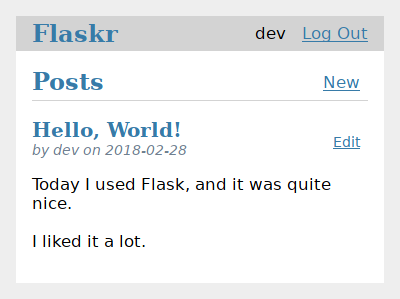

Басшылық
========

.. toctree::
    :caption: Contents:
    :maxdepth: 1

    layout
    factory
    database
    views
    templates
    static
    blog
    install
    tests
    deploy
    next

Бұл нұсқаулықта сіз Flask деп аталатын негізгі блог жүргізу қосымшасын құрумен танысасыз. Пайдаланушылар тіркеле алады, жүйеге кіре алады, хабарламалар жасай алады және өз жазбаларын өңдей немесе жоя алады. Сіз қосымшаны басқа компьютерлерге жинап, орната аласыз.

Сіз Python-мен бұрыннан таныссыз деп қабылдаймыз. Python құжаттамасындағы `official tutorial`_ алдымен оны зерттеудің немесе қараудың тамаша тәсілі.

.. _ресми оқулық: https://docs.python.org/3/tutorial/

Бұл нұсқаулық жақсы бастау нүктесін арналған болса да, ол Flasks-тің барлық мүмкіндіктерін қамтымайды. Flask не істей алатындығы туралы шолу үшін :doc:`/quickstart` қараңыз , содан кейін көбірек білу үшін құжаттарға сүңгіңіз.
Нұсқаулық тек Flask және Python ұсынған нәрсені пайдаланады. Басқа жобада кейбір тапсырмаларды жеңілдету үшін :doc:`/extensions` немесе басқа кітапханаларды пайдалануды шеше аласыз.

.. image:: flaskr_login.png
    :align: center
    :class: screenshot
    :alt: screenshot of login page

Flask өте икемді. Бұл сізден нақты жобаны немесе кодтың орналасуын пайдалануды талап етпейді. Дегенмен, бірінші рет іске қосқан кезде құрылымдалған тәсілді қолдану пайдалы. Бұл нұсқаулық аздап шаблондық дайындықты қажет етеді дегенді білдіреді, бірақ бұл жаңа әзірлеушілердің жиі кездесетін қателіктерін болдырмау үшін жасалады және бұл оңай кеңейтілетін жобаны жасайды. Flask-ке ыңғайлы болғаннан кейін, сіз бұл дизайннан бас тарта аласыз және колбалардың икемділігін толық пайдалана аласыз.

.. image:: flaskr_edit.png
    :align: center
    :class: screenshot
    :alt: screenshot of edit page

:gh:` <examples/tutorial> - оқу жобасы flask репозиторийінде мысал ретінде қол жетімді`, егер сіз өз жобаңызды нұсқаулыққа сәйкес соңғы өніммен салыстырғыңыз келсе.

 :doc:`layout` - ге өтіңіз.
